# Visual Recognition Assignment 1

## Author: K. S. Tarun  
**Student ID:** IMT2022034  
**GitHub Repository:** [Insert Link Here]  

---

## Overview  
This project consists of two major tasks:  
1. **Coin Detection, Segmentation, and Counting**  
2. **Image Stitching for Panorama Generation**  

Both tasks utilize computer vision techniques implemented using OpenCV and related libraries.

---
# Part 1: Coin Detection

## Requirements
Before running the script, ensure you have the required dependencies installed:

```bash
pip install opencv-python
pip install numpy
```

## Running the Script
Run the following command to execute the coin detection script:

```bash
python coin_detector.py
```

## Functionality
- Converts the image to grayscale and applies Gaussian blur to reduce noise.
- Uses binary thresholding to separate coins from the background.
- Detects edges using Canny edge detection and strengthens them with dilation.
- Extracts contours using `cv2.findContours()` and filters based on area and circularity.
- Highlights detected coins and overlays the total count on the image.

## Key Functions Used
- `cv2.GaussianBlur()` – Applies Gaussian filter for noise reduction.
- `cv2.threshold()` – Performs binary thresholding to segment the coins.
- `cv2.Canny()` – Detects edges in the image.
- `cv2.dilate()` – Strengthens edges and closes small gaps.
- `cv2.findContours()` – Identifies contours in the processed image.
- `cv2.drawContours()` – Highlights detected coins and assigns random colors to segmented regions.
- `random.randint()` – Generates random colors for segmented coins.
- `numpy.ones()` – Creates a kernel for morphological operations.

---

# Part 2: Image Stitching

## Requirements
Ensure you have the required dependencies installed:

```bash
pip install opencv-python
pip install numpy
```

## Running the Script
Run the following command to execute the image stitching script:

```bash
python stitchingv2.py
```

## Functionality
- Detects keypoints and extracts descriptors using SIFT.
- Matches features between images using the Brute Force Matcher.
- Computes the homography matrix to align images.
- Warps images and overlays them to create a stitched panorama.
- Saves intermediate images for visualization, including keypoints and matched features.

## Key Functions Used
- `cv2.SIFT_create()` – Detects keypoints and extracts descriptors.
- `cv2.BFMatcher()` – Matches features between images.
- `cv2.findHomography()` – Computes the transformation matrix for alignment.
- `cv2.warpPerspective()` – Warps images based on homography.
- `cv2.drawKeypoints()` – Draws keypoints on images for visualization.
- `cv2.drawMatches()` – Visualizes matched features between images.

## Output Files
- `KeypointsImage1.jpg`, `KeypointsImage2.jpg` – Visualized keypoints for input images.
- `FeatureMatches1.jpg` – Matched features between images.
- `half_stitched.jpg` – Intermediate stitched image.
- `panorama_3.jpg` – Final panoramic output.

## Conclusion
This implementation successfully detects and matches key features between images to create a seamless panoramic view.


## Requirements  
- Python 3.x  
- OpenCV  
- NumPy   

Install dependencies using:  
```bash
pip install opencv-python numpy
```

---

## Running the Code  
- **Coin Detection:** Run `coin_detector.py`  
- **Image Stitching:** Run `stitchingv2.py`  

Ensure the required images are placed in the appropriate directory.

---

## Conclusion  
This project demonstrates the use of computer vision techniques for object detection and image alignment. The final implementations successfully achieve:  
✔️ Accurate coin detection and segmentation  
✔️ Seamless image stitching for panorama generation  

---

### **PART-1-Input**
- `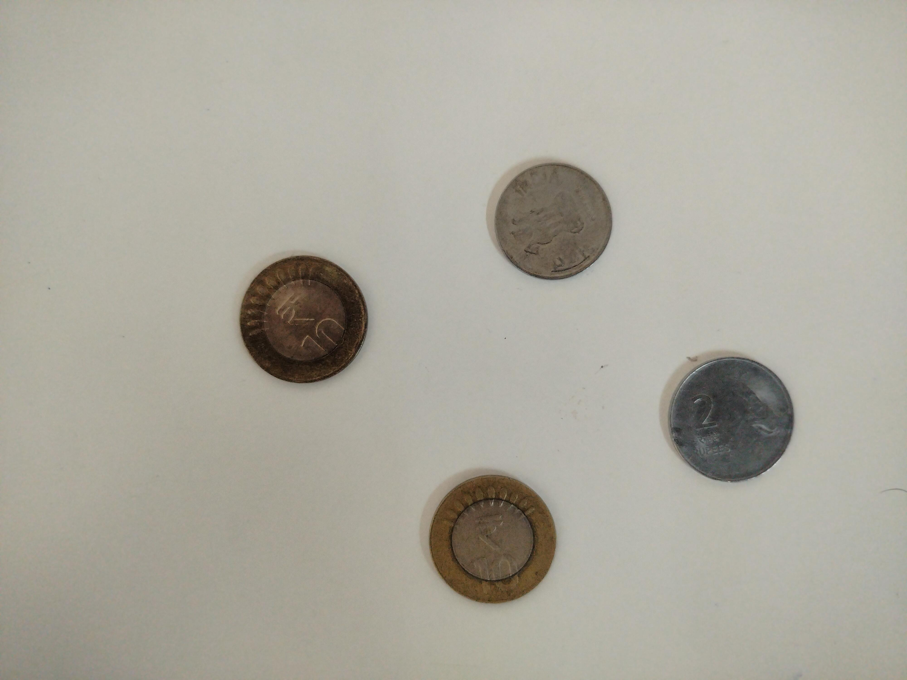
  *The image containing scattered coins.*

### **Output**
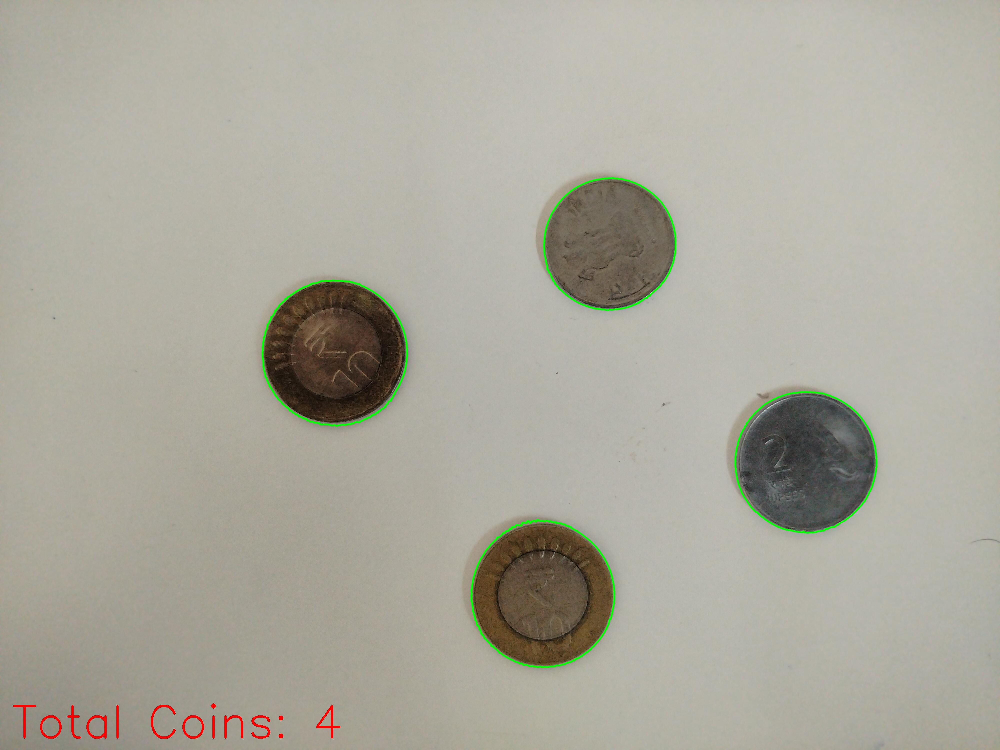
*Image with detected coin contours and count displayed.*

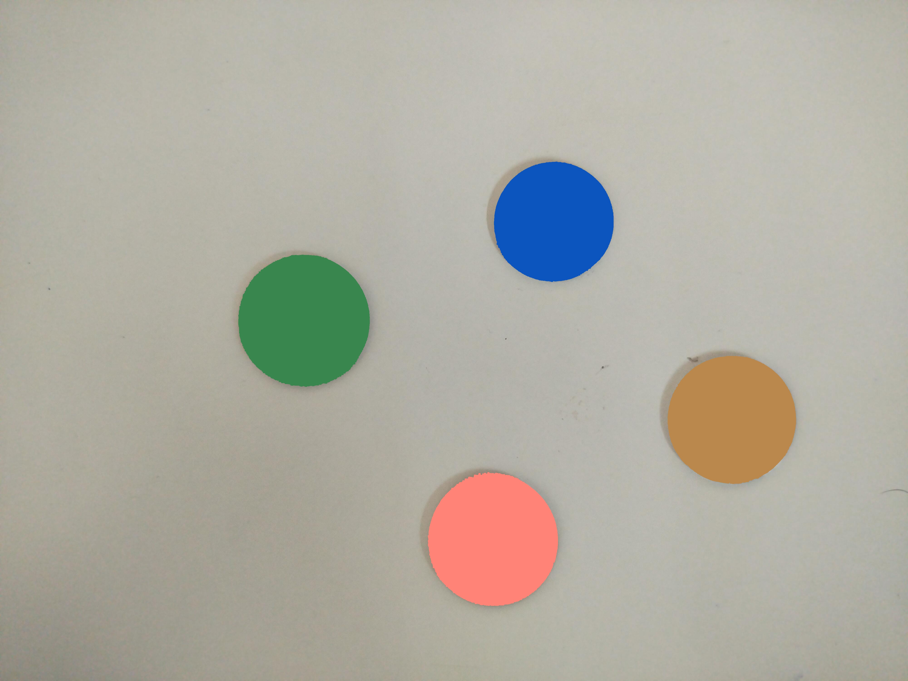
*Image with segmented coins in different colors.*

---

### **Input**
- `input_images/middle.jpg` – Middle image.
- `input_images/left.jpg` – Left image.
- `input_images/right.jpg` – Right image.

### **Output**
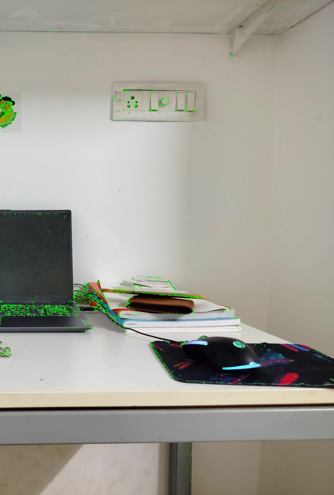
*Keypoints detected in right image.*

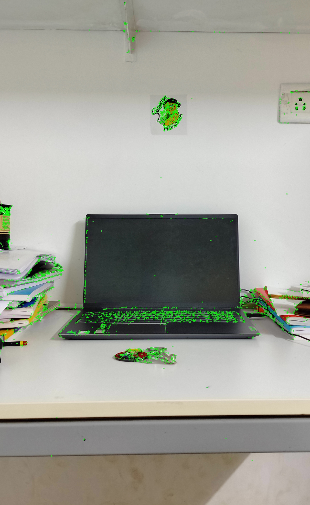
*Keypoints detected in middle image.*

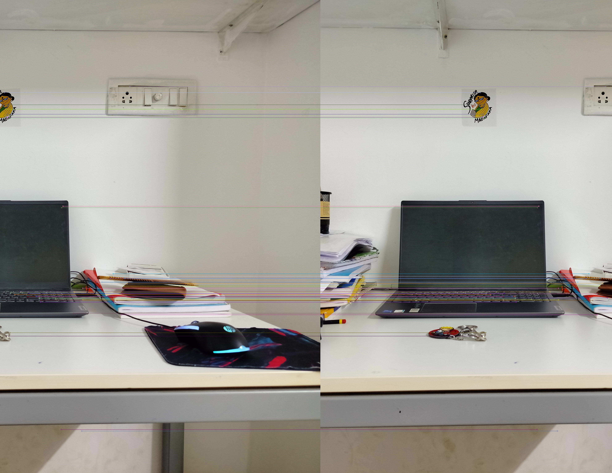
*Matched features between right and middle images.*

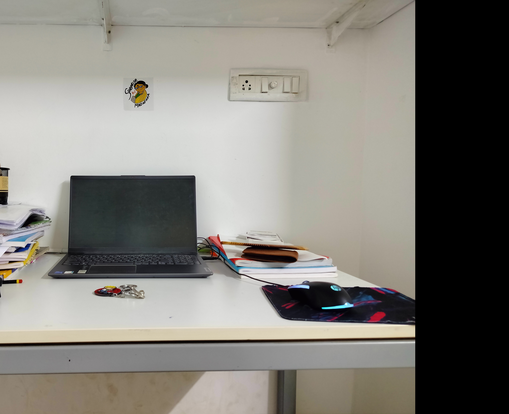
*Intermediate stitched image.*

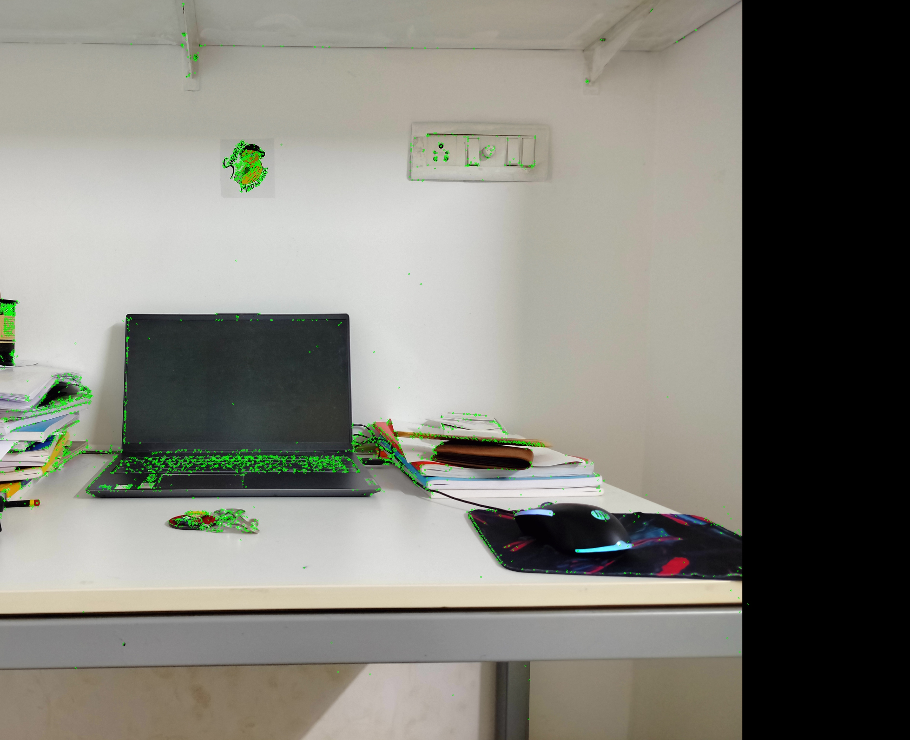
*Keypoints detected in half-stitched image.*

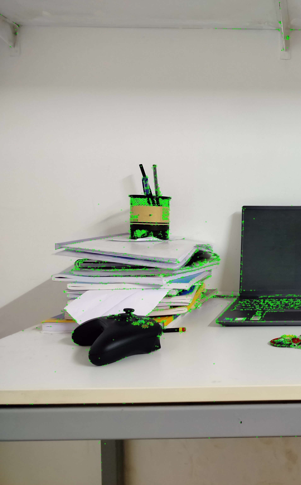
*Keypoints detected in left image.*

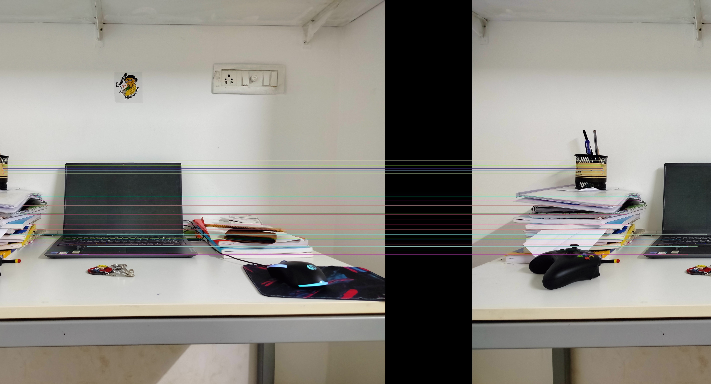
*Matched features between half-stitched and left images.*

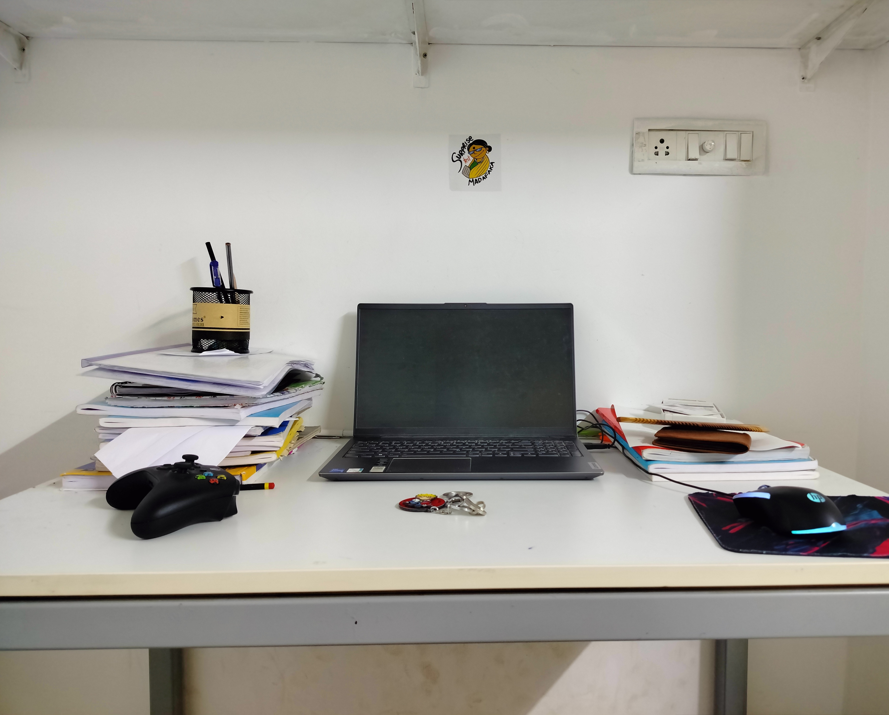
*Final stitched panorama.*
